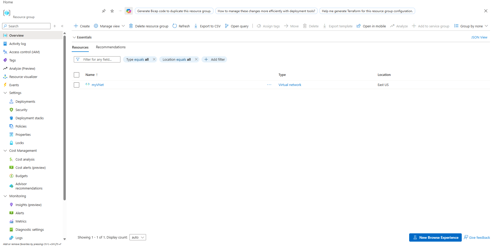
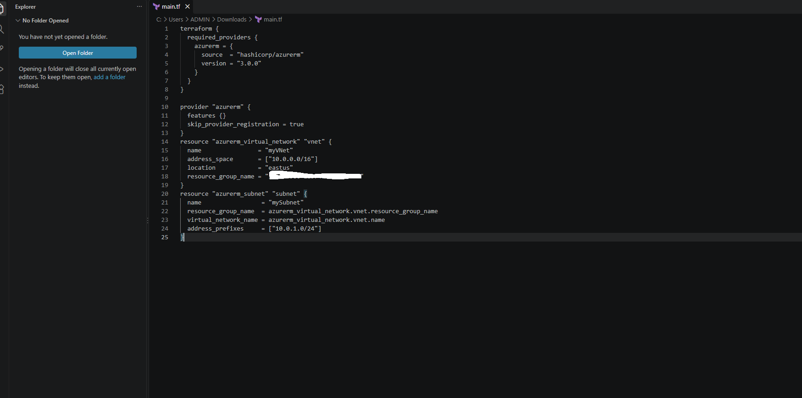
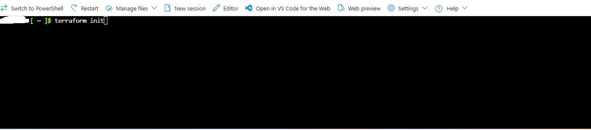
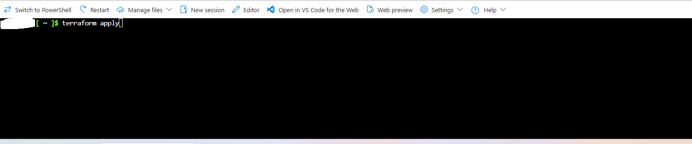
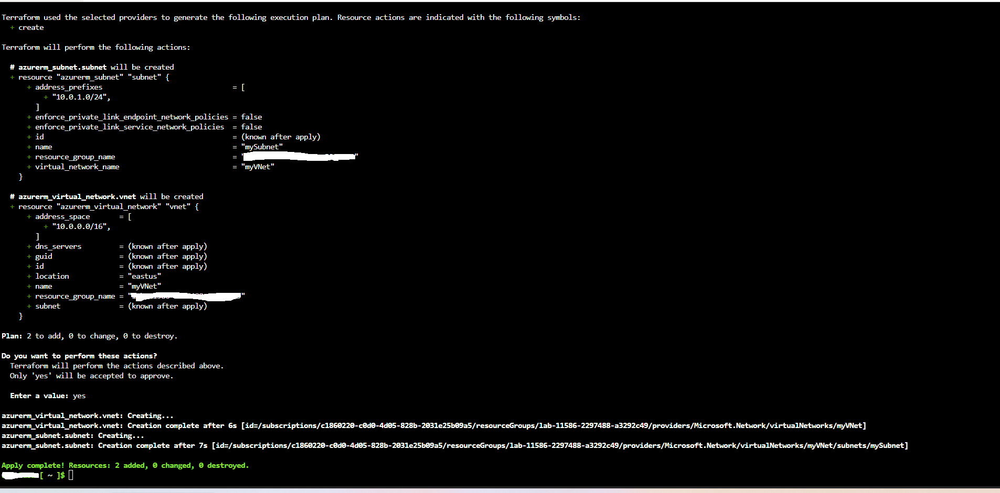

# Declarative Azure Virtual Network Provisioning with Terraform

Documentation covering the declarative provisioning of an Azure Virtual Network and subnet using HashiCorp Terraform, provider configuration, execution workflow, and portal inventory verification in the East US region.

---

## 1. Architecture & Provisioned Resources

### Core Infrastructure Summary

| Resource | Resource Name | Address CIDR | Region |
| :--- | :--- | :--- | :--- |
| **Virtual Network** | `myVNet` | `10.0.0.0/16` | East US |
| **Subnet** | `mySubnet` | `10.0.1.0/24` | East US |

---

### Resource Inventory Validation

*Resource group overview confirming the provisioned Virtual Network.*

---

## 2. Step-by-Step Implementation

### Step 1: Define Terraform Configuration

Authored the declarative infrastructure configuration in `main.tf` utilizing the HashiCorp `azurerm` provider (version `3.0.0`), specifying the target resource group, location, virtual network address space, and subnet prefix.

* **Configuration File:** `main.tf`
* **Provider:** `azurerm` (~> `3.0.0`)
* **Virtual Network Name:** `myVNet` (`10.0.0.0/16`)
* **Subnet Name:** `mySubnet` (`10.0.1.0/24`)

*Reviewing provider settings, virtual network specifications, and subnet block in main.tf.*

---

### Step 2: Initialize Terraform Working Directory

Executed initialization within Azure Cloud Shell to download and cache the necessary `azurerm` provider plugins and set up the local backend state environment.

* **Execution Command:** `terraform init`
* **Target Environment:** Azure Cloud Shell (Bash)

*Initializing the Terraform working directory to download provider dependencies.*

---

### Step 3: Plan and Apply Infrastructure Deployment

Triggered the deployment run via `terraform apply`, validated the execution plan showing 2 resources scheduled for creation, approved the action, and confirmed successful state persistence.

* **Execution Plan:** 2 to add, 0 to change, 0 to destroy
* **Created Resources:** `azurerm_virtual_network.vnet`, `azurerm_subnet.subnet`
* **Application Status:** Apply complete (Resources: 2 added)

*Execution run of terraform apply generating execution plan.*

*Reviewing plan output, confirming approval, and validating resource creation.*

---

### Step 4: Verify Provisioned Resources in Azure Portal

Inspected the target resource group within the Azure Portal to confirm that `myVNet` and its underlying subnet `mySubnet` were created and active in the East US region.

* **Provisioned VNet:** `myVNet`
* **Location:** East US
* **Associated Subnet:** `mySubnet` (`10.0.1.0/24`)

*Validating the presence and health of myVNet inside the Azure Portal resource group.*
